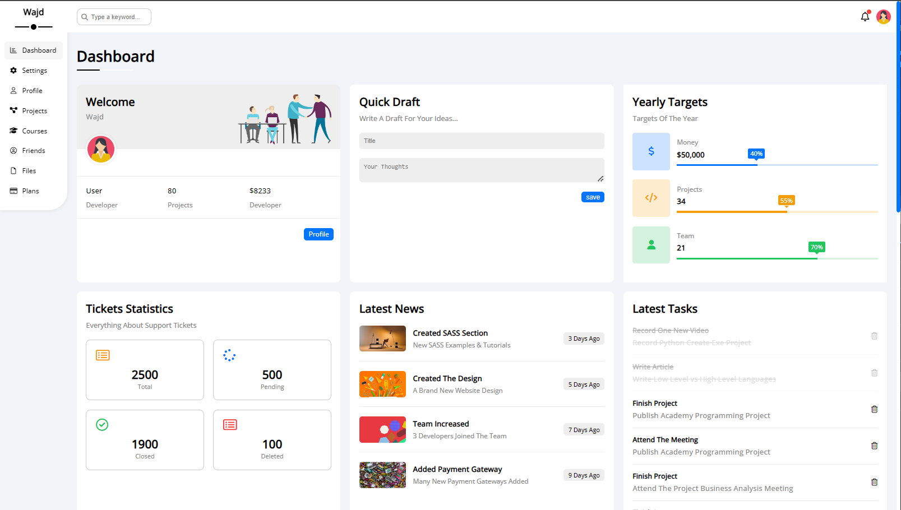
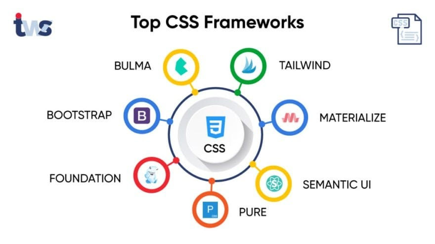
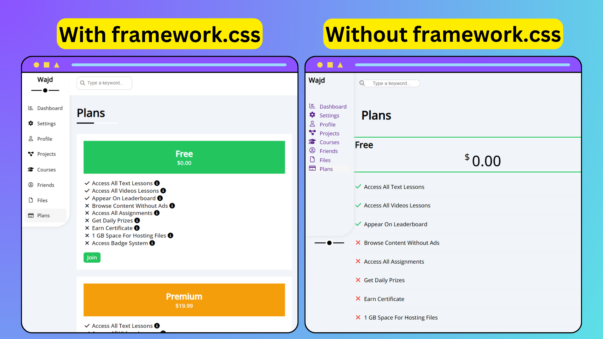

# Dashboard, Html & CSS

Hello and welcome to another project! Today, we will be focusing on **beginners who are starting their journey in programming with HTML & CSS**.



If you like the project, please give the project a GitHub ⭐

[Preview Website "Demo"](https://wajdwael.github.io/Dashboard/)

---

## Project Idea 💡

Our project is about creating a **dashboard with 8 sub-pages**, using advanced CSS techniques and structure. Although this project is more suitable for advanced CSS developers, we will provide clear steps and guidance for all levels to benefit from.

Before we start, let's understand some core concepts that will make our lives easier while working on this project. 

1. This project will teach how to separate your code into small pieces, which will be readable, and easier to catch errors. 
2. advanced skills to structure your code and make it clean and readable.

---

## Start here ⏬

We'll start with a simple **structuring** and **boilerplate** code!

1. Download `images` folder out of this repo
2. Create `CSS` folder with `framework.css` & `main.css` CSS files.
3. Create `pages` folder, it'll hold website's pisces all the HTML files and their CSS styles.
       - `Html` folder, with 7 sub pages:
      1. `courses.html`, 5. `files.html`
      2. `friends.html`, 6. `plans.html`
      3. `profile.html`, 7. `projects.html`
      4. `settings.html`
   
   - `CSS` folder, with the same names but REPLACE `.html` with `.css`
4. [Jump to the code](https://github.com/wajdwael/dashborad/#Jump-to-the-code) 🦘


**NOTE: We will discuss the reason behind creating this huge number of pages rather than, pushing all the code in the `index.html` file, in more detail later on.**

---

## Jump to the code 🖥️

Let's create the `Boilerplate` to ever single page, this `Bulareplatte` will containe all the common components between the pages:

- Head `<Meta>` tag
- Google fonts
- `framework.css` file
- Sidebar
- Searchbar
- Heading


Before we start coding the `Boilerplate` we need to understand:

# What is the `<Meta>` tag? 
[Go to Boilerplate](https://github.com/wajdwael/dashboard/#Boilerplate)

# Meta tag explanation:

```HTML
<meta charset="UTF-8">
```
Defines the character set that will be used in the site. UTF-8 or `8-bit Unicode Transformation Format`, is the standard character used with HTML.

--
```HTML
<meta http-equiv="X-UA-Compatible" content="IE=edge">
```
You use thia meta tag to define the version of Internet Explorer in which the web page will be renedered.

> This tag will ensure that the website will not be rendered as an older version of Internet Explorer, which tend to be buggy.

--
```HTML
<meta name="viewport" content="width=device-width, initial-scale=1.0">
```

**viewport** refers to how the site is displayed on different screen sizes, and how much visual area a user has available.

> 1. content="width=device-width is the first step to make sure that websites look good on mobile devices.

> 2. initial-scale=1.0 sets how the webpage scales, and sets the initial zoom when the page is first loaded by the browser.

----


# The idea of `framework.css`




If you take a look on `framework.css` file you will find this type of class:

```CSS
/* ==========Widths========== */
.w-full{
    width: 100%;
}
.w-100{
    width: 100px;
}
/* =========Spacing========= */
/* padding */
.p-10{
    padding: 10px;
}
.pb-15{
    padding-bottom: 15px;
}
/* margins */
.m-0{
    margin: 0;
}
.mt-5{
    margin-top: 5px;
}
/* ===========backgrounds=========== */
.bg-white{
    background-color: white;
}
.bg-eee{
    background-color: #EEE;
}
```

Writing the `framework.css` from scratch **will help you understand the famous CSS frameworks** for instance Bootstrap, Tailwind CSS, Bulma ... We will use this file to collect the most CSS styles we have across the website. Here are some advantages of using this coding way:

1. Having one ID, an invariant look, and feel across the website.
2. Time Efficiency, let's see an example:  We have an image that illustrates the difference between a website page with and without framework.css. It may need some adjustments to be properly incorporated. On the other hand, we have the same page without framework.css, but with the CSS styles that we added at the end.

More about frameworks advantages and disadvantages out of FreeCodeCamp... [Read More](https://www.freecodecamp.org/news/css-frameworks-vs-custom-css/#:~:text=CSS%20frameworks%20provide%20a%20consistent,easier%20to%20navigate%20and%20understand.)

---

# Boilerplate 
```Html
<!DOCTYPE html>
<html lang="en">
    <head>
        <meta charset="UTF-8">
        <meta http-equiv="X-UA-Compatible" content="IE=edge">
        <meta name="viewport" content="width=device-width, initial-scale=1.0">

        <!-- TODO: Change the title -->
        <title>Files</title>
    
        <!-- CSS  -->

        <link rel="stylesheet" href="css/framework.css">
        <!-- TODO: change the name of the CSS file to fit the page -->
        <link rel="stylesheet" href="./styles/files.css">

        <!-- Google fonts -->
        <link rel="preconnect" href="https://fonts.googleapis.com" />
        <link rel="preconnect" href="https://fonts.gstatic.com" crossorigin />
        <link href="https://fonts.googleapis.com/css2?family=Open+Sans:wght@300;500&display=swap" rel="stylesheet" />
        <link rel="stylesheet" href="https://cdnjs.cloudflare.com/ajax/libs/font-awesome/6.2.0/css/all.min.css" integrity="sha512-xh6O/CkQoPOWDdYTDqeRdPCVd1SpvCA9XXcUnZS2FmJNp1coAFzvtCN9BmamE+4aHK8yyUHUSCcJHgXloTyT2A==" crossorigin="anonymous" referrerpolicy="no-referrer" />
    </head>
    <body>
        <!-- Start every page with the .page class -->
        <section class="page d-flex">
            <!-- Sidebar  -->
           <nav class="sidebar bg-white p-relative">
               <h3 class="p-relative txt-center mt-0">Wajd</h3>
              
              <!-- TODO: add '.active' to the appropriate page -->
              <ul>
                   <li>
                      <a class="d-flex align-center fs-14 black rad-6 p-10" href="/">
                          <i class="fa-regular fa-chart-bar fa-fw"></i>
                          <span>Dashboard</span>
                      </a>
                   </li>
                   <li>
                      <a class="d-flex align-center fs-14 black rad-6 p-10" href="/pages/settings.html">
                          <i class="fa-solid fa-gear fa-fw"></i>
                          <span>Settings</span>
                      </a>
                   </li>
                   <li>
                      <a class="d-flex align-center fs-14 black rad-6 p-10" href="/pages/profile.html">
                          <i class="fa-regular fa-user fa-fw"></i>
                          <span>Profile</span>
                      </a>
                   </li>
                   <li>
                      <a class="d-flex align-center fs-14 black rad-6 p-10" href="/pages/projects.html">
                          <i class="fa-solid fa-diagram-project fa-fw"></i>
                          <span>Projects</span>
                      </a>
                   </li>
                   <li>
                      <a class="d-flex align-center fs-14 black rad-6 p-10" href="/pages/courses.html">
                          <i class="fa-solid fa-graduation-cap fa-fw"></i>
                          <span>Courses</span>
                      </a>
                   </li>
                   <li>
                      <a class="d-flex align-center fs-14 black rad-6 p-10" href="/pages/friends.html">
                          <i class="fa-regular fa-circle-user fa-fw"></i>
                          <span>Friends</span>
                      </a>
                   </li>
                   <li>
                      <a class="d-flex align-center fs-14 black rad-6 p-10" href="/pages/files.html">
                          <i class="fa-regular fa-file fa-fw"></i>
                          <span>Files</span>
                      </a>
                   </li>
                   <li>
                      <a class="active d-flex align-center fs-14 black rad-6 p-10" href="/pages/plans.html">
                          <i class="fa-regular fa-credit-card fa-fw"></i>
                          <span>Plans</span>
                      </a>
                   </li>
               </ul>
           </nav>
        <section class="content w-full">
            <!-- Search Bar -->
            <header class="head bg-white p-15 between-flex">
                <div class="search p-relative">
                    <input class="p-10" type="search" placeholder="Type a keyword...">
                </div>
                <div class="icons d-flex align-center">
                    <span class="notification p-relative">
                        <i class="fa-regular fa-bell fa-lg"></i>
                    </span>
                    
                </div>
            </header>

            <!-- TODO: change the title based on the appropriate page -->
            <h1 class="p-relative fixed-space">Plans</h1>
        </section>
    </body>
```

---


# Would it be better to include CSS styles in different files? & Why not have them all in index.css?

We have 9 different files in this project, 7 files for every single page in this project, the `main.css` file includes all the common styles across the website.

**Coding isn't only coding**, It's **a combination of** problem-solving and continuous learning, it also learns from other programmers' code, testing, and more.

When I provide you with 7 different pages with all CSS styles it will be more readable for you to absorb the code, also it's easy for testing and fixing errors, and easy also to code.

---


# Go more deeply!

# How to improve Accessibility in HTML code?

1. **Use Semantic HTML**

    Semantic HTML are elements that convey meaning and structure to the content they enclose. It involves choosing the most appropriate HTML element based on the purpose and meaning of the content. More on them later ... [▶️Jump](https://github.com/wajdwael/dashbaord/#Html5-tags).

2. **Alt text**

    Use the alt attribute to provide descriptive alternative text for images. This helps visually impaired users who use screen readers to understand the content of the image.

3. **Use the appropriate HTML tag**

    When adding headings to your website, it's important to use the appropriate heading level, as screen readers used by visually impaired users rely on the heading level to pronounce it correctly.  Use the heading level that accurately reflects the importance of the content.

---

# Html5 tags:

--
### Html `<header>` Tag:
Represents the **introductory content**, typically containing branding, navigation, and introductory elements.

--
### Html `<nav>` Tag:
Represents **navigation links**, such as a **menu** or a list of links to different pages or sections of a website.

--
### Html `<article>` Tag:
Represents **self-contained content**, such as a blog post, a news article, or a form post.

--
### Html `<section>` Tag:
Represents **a standalone section of content** within a document, typically grouped by a common theme.

---

# Variables in CSS

- What is a Variable?
    - It's an Identifier that is used to store a value. It represents a memory location where data can be stored and retrieved during the execution of a program.

- How to define Variables in CSS?
    - By typing: `--VariableName`

- Where to add Variables in CSS?
    - You can add them to a particular class:
        ```CSS
        .card1{
            --color: red;
            background-color: var(--color);
            color: var(--color);
            border-color: var(--color);
        }
        ```
    - Or at the `:root` selector:
        - The `:root selector` is used to declare the variable **globally**, making it available for use in all elements within the document
        ```CSS
        :root{
            --blue: #0075ff;
            --blue-alt: #0d69d5;
            --orange: #F59E0B;
        }
        ```

- How to use Variables inside a CSS file?
    - `var(pass the name here)`
         ```CSS
        .page{
            font-size: var(--fs-13);
        }
        ```

---

## Some CSS Properties explanation:

- `box-sizing: border-box;`
    - When you apply box-sizing: border-box;, the width and height properties of the element include the padding and border, rather than being added to them. This ensures that the total width and height of the element remain as you specified.

- `width: fit-content;` 
    - is used to set the width of an element based on its content.

- `appearance: none;` 
    - is used to remove or reset the default styling of form controls, such as buttons, checkboxes, radio buttons, and dropdown menus, provided by the user agent (browser). **We used it for radios and checkboxes.**


---

**Writing this README took a significant amount of effort and time. Please consider supporting us by giving a star ⭐ to the repository. It would mean a lot to us. Thank you for your dedication and contribution.**